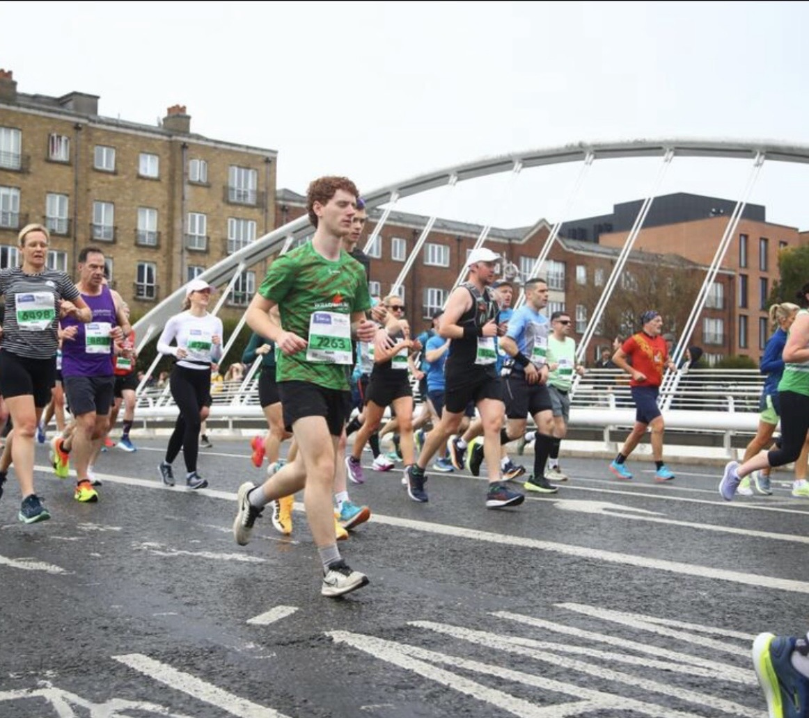
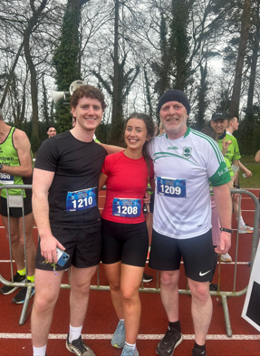
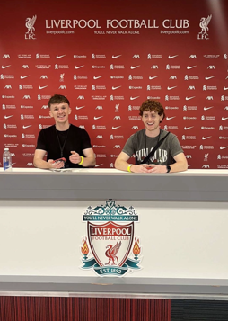
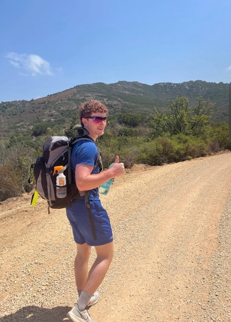
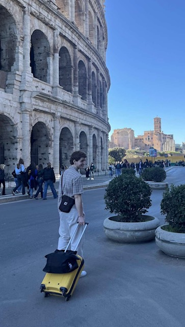

*Some small things about me that don't quite fit on a CV - but matter just as much.*

---

## 🏃 Sport & Fitness

Sport has always been a cornerstone of my life - whether it's pushing through the final 
miles of a marathon or enjoying football with friends. 

{fig-alt="Dublin Marathon" width="400px"}

:::: {.columns}
::: {.column width="50%"}
{fig-alt="Sport with friends" width="280px"}
:::
::: {.column width="50%"}
{fig-alt="Liverpool FC" width="280px"}
:::
::::

---

## 🌍 Travel

I love to broaden my perspective by getting out there and seeing the world. Every trip teaches me something new!

:::: {.columns}
::: {.column width="50%"}
::: {.travel-photo}

:::
:::
::: {.column width="50%"}
::: {.travel-photo}

:::
:::
::::

---

## 🇮🇪 As Gaeilge

::: {.callout-note appearance="minimal"}
Is cainteoir díograiseach Gaeilge mé atá tar éis freastal ar an nGaeltacht ceithre huaire agus labhraím go líofa í. Tá an teanga ina cuid thábhachtach de mo chéannacht agus de mo chultúr.

*I am a dedicated Irish speaker who has attending the Gaeltacht four times and speak Irish fluently. The language is an important part of my identity and culture.*
:::

## 🎥 Even Some Modelling...

Not something that makes it onto the CV - but here we are! Featured in an ad for WillowWarm, a Shamrock Products Ltd product.

[▶ Watch the Ad on Instagram](https://www.instagram.com/willowwarmirl/reel/DTNws2yjNCv/){target="_blank" .btn .btn-primary}